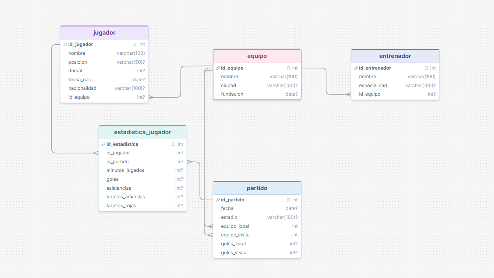
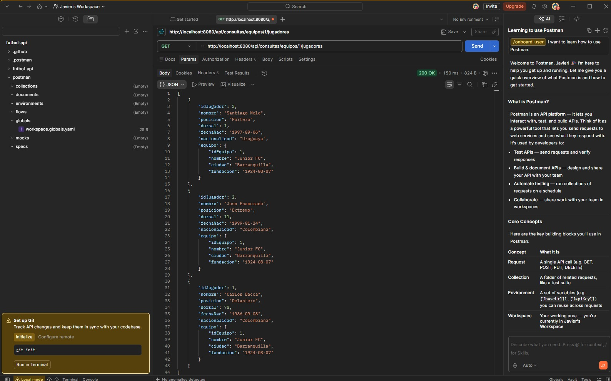
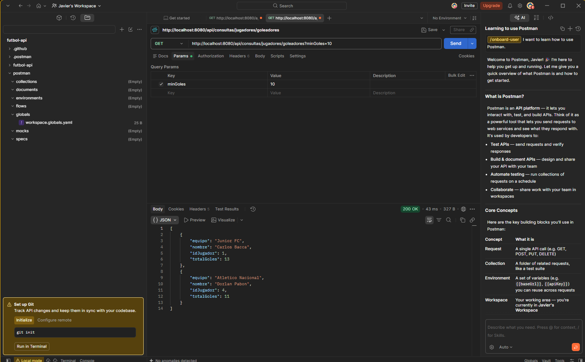
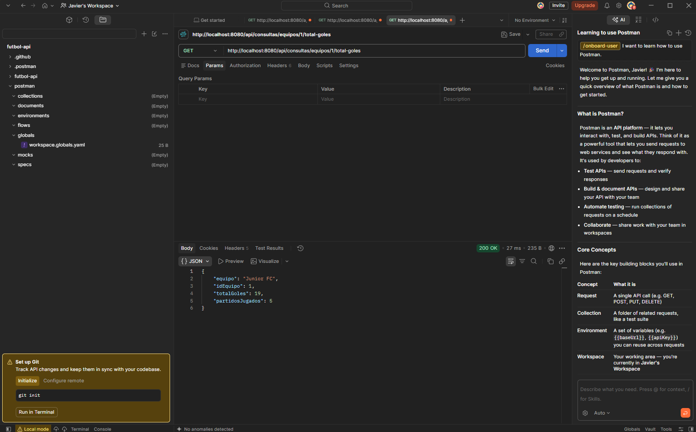
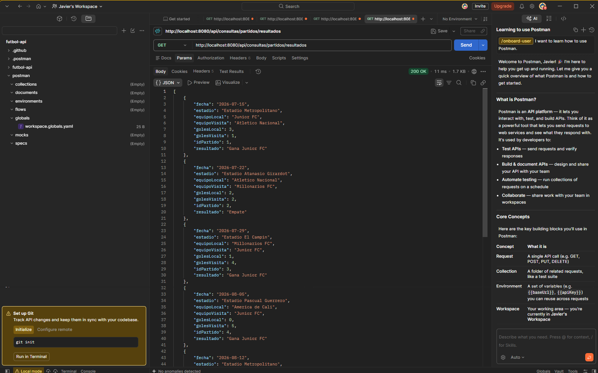
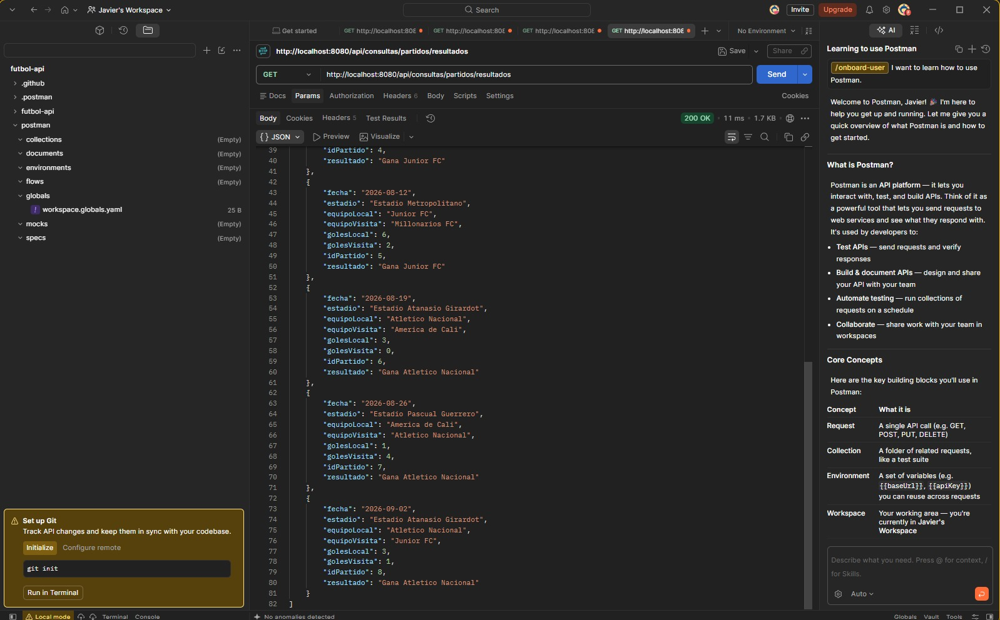

# API REST - Equipo de Fútbol ⚽

Plan de mejoramiento – Competencia 220501096 (ADSO, Ficha 3350709).
API en **Spring Boot 3 + MySQL** para gestionar equipos, jugadores, entrenadores, partidos y estadísticas.

## Tecnologías

- Java 17 o superior (compatible con Java 25), Maven
- Spring Boot 3.5 (Web, Data JPA, Validation)
- MySQL 8 o superior
- Swagger UI (springdoc) para la documentación
- Postman para las pruebas

## Cómo correrlo

1. **Crear la base de datos:** abre `database/futbol_db.sql` en MySQL Workbench y ejecútalo completo (el rayo ⚡). Crea `futbol_db`, las 5 tablas y datos de prueba.
2. **Configurar la conexión:** en `src/main/resources/application.properties` cambia `spring.datasource.username` y `spring.datasource.password` por los de tu MySQL.
3. **Ejecutar:** desde el IDE corre `FutbolApiApplication`, o en consola:
   ```bash
   mvn spring-boot:run
   ```
4. La API queda en `http://localhost:8080`.
   Documentación Swagger: `http://localhost:8080/swagger-ui.html`
5. **Postman:** importa `postman/futbol-api.postman_collection.json`.

## Estructura (arquitectura por capas)

```
src/main/java/com/sena/futbol
├── model/        Entidades JPA (cada una es una tabla)
├── repository/   Acceso a datos (JpaRepository + consultas nativas)
├── service/      Lógica de negocio y validaciones
├── controller/   Endpoints REST (@RestController)
├── dto/          Objetos de entrada (Request) y proyecciones de las consultas
└── exception/    Manejo global de errores (404, 400, 409)
```

El flujo de una petición es: **Controller → Service → Repository → MySQL**.

- El **controller** solo recibe la petición y responde.
- El **service** valida (que el equipo exista, que un equipo no juegue contra sí mismo, etc.).
- El **repository** habla con la base de datos.

## Modelo relacional

| Relación | Tipo | Cómo se ve en el código |
|---|---|---|
| Equipo – Jugador | 1 a N | `@ManyToOne` en `Jugador` con `@JoinColumn(name = "id_equipo")` |
| Equipo – Entrenador | 1 a N | `@ManyToOne` en `Entrenador` |
| Equipo – Partido | 1 a N (dos veces) | Dos `@ManyToOne` en `Partido`: `equipo_local` y `equipo_visita` |
| Jugador – Estadística | 1 a N | `@ManyToOne` en `EstadisticaJugador` |
| Partido – Estadística | 1 a N | `@ManyToOne` en `EstadisticaJugador` |

Para el pantallazo del modelo: en MySQL Workbench ve a **Database → Reverse Engineer**, selecciona `futbol_db` y te genera el diagrama con las relaciones.

## Endpoints CRUD

Cada recurso tiene los mismos 5 endpoints:

| Método | URL | Qué hace |
|---|---|---|
| GET | `/api/{recurso}` | Lista todos |
| GET | `/api/{recurso}/{id}` | Busca uno |
| POST | `/api/{recurso}` | Crea (responde 201) |
| PUT | `/api/{recurso}/{id}` | Actualiza |
| DELETE | `/api/{recurso}/{id}` | Elimina (responde 204) |

Recursos: `equipos`, `jugadores`, `entrenadores`, `partidos`, `estadisticas`.

Ejemplo de body para crear un jugador:
```json
{
  "nombre": "Teofilo Gutierrez",
  "posicion": "Delantero",
  "dorsal": 29,
  "fechaNac": "1985-05-17",
  "nacionalidad": "Colombiana",
  "idEquipo": 1
}
```

## Consultas nativas

Todas están en los repositorios con `@Query(value = "...", nativeQuery = true)` y se exponen en `ConsultaController`.

### a) Jugadores de un equipo específico
`GET /api/consultas/equipos/{idEquipo}/jugadores` → parámetro por **path**
```sql
SELECT * FROM jugador WHERE id_equipo = :idEquipo ORDER BY dorsal
```
Como devuelve todas las columnas de `jugador`, Spring la convierte directo a la entidad `Jugador`.

### b) Jugadores con más de X goles (X de dos cifras)
`GET /api/consultas/jugadores/goleadores?minGoles=10` → parámetro por **query**
```sql
SELECT j.id_jugador AS idJugador, j.nombre AS nombre, e.nombre AS equipo,
       CAST(SUM(ej.goles) AS SIGNED) AS totalGoles
FROM jugador j
INNER JOIN estadistica_jugador ej ON ej.id_jugador = j.id_jugador
LEFT JOIN equipo e ON e.id_equipo = j.id_equipo
GROUP BY j.id_jugador, j.nombre, e.nombre
HAVING SUM(ej.goles) > :minGoles
ORDER BY totalGoles DESC
```
- Los goles están repartidos por partido en `estadistica_jugador`, así que hay que **sumarlos** por jugador (`GROUP BY` + `SUM`).
- Se usa `HAVING` y no `WHERE` porque la condición es sobre el resultado de la suma. `WHERE` filtra filas antes de agrupar; `HAVING` filtra grupos después.
- El service valida que X esté entre 10 y 99; si no, responde 400.

### c) Total de goles de un equipo en todos sus partidos
`GET /api/consultas/equipos/{idEquipo}/total-goles`
```sql
SELECT e.id_equipo AS idEquipo, e.nombre AS equipo,
       COUNT(p.id_partido) AS partidosJugados,
       CAST(COALESCE(SUM(
           CASE WHEN p.equipo_local = e.id_equipo THEN p.goles_local
                ELSE p.goles_visita END), 0) AS SIGNED) AS totalGoles
FROM equipo e
LEFT JOIN partido p ON p.equipo_local = e.id_equipo OR p.equipo_visita = e.id_equipo
WHERE e.id_equipo = :idEquipo
GROUP BY e.id_equipo, e.nombre
```
- Un equipo puede haber jugado de local o de visitante. El `CASE` escoge la columna correcta en cada partido.
- `LEFT JOIN` + `COALESCE(..., 0)` hacen que un equipo sin partidos devuelva 0 en vez de nada.

### d) Resultados de todos los partidos con nombres de equipos
`GET /api/consultas/partidos/resultados`
```sql
SELECT p.id_partido AS idPartido, DATE_FORMAT(p.fecha, '%Y-%m-%d') AS fecha, p.estadio AS estadio,
       el.nombre AS equipoLocal, p.goles_local AS golesLocal,
       p.goles_visita AS golesVisita, ev.nombre AS equipoVisita,
       CASE WHEN p.goles_local > p.goles_visita THEN CONCAT('Gana ', el.nombre)
            WHEN p.goles_local < p.goles_visita THEN CONCAT('Gana ', ev.nombre)
            ELSE 'Empate' END AS resultado
FROM partido p
INNER JOIN equipo el ON el.id_equipo = p.equipo_local
INNER JOIN equipo ev ON ev.id_equipo = p.equipo_visita
ORDER BY p.fecha
```
- La tabla `equipo` se une **dos veces** con alias distintos (`el` = local, `ev` = visitante), porque `partido` tiene dos llaves foráneas hacia `equipo`.

**¿Por qué las consultas b, c y d devuelven interfaces (`JugadorGolesDTO`, etc.)?** Porque el resultado no es una tabla completa sino columnas calculadas. Spring Data llena la interfaz usando los **alias** del SQL: el alias `totalGoles` se asigna al método `getTotalGoles()`. Si el alias no coincide, el valor llega en `null`.

## Resultados esperados con los datos de prueba

| Consulta | Resultado |
|---|---|
| a) equipo 1 | Mele (1), Enamorado (11), Bacca (70) |
| b) minGoles=10 | Bacca 13, Pabón 11 |
| c) equipo 1 | Junior FC: 5 partidos, 19 goles |
| d) | 8 partidos con nombres y ganador |

## Manejo de errores

`GlobalExceptionHandler` (`@RestControllerAdvice`) responde un JSON claro en vez de un error 500:

| Código | Cuándo |
|---|---|
| 400 | Validaciones fallidas (`@NotBlank`, `@Min`...), X < 10, equipo contra sí mismo, JSON mal escrito |
| 404 | El id no existe |
| 409 | Se intenta borrar un registro con datos relacionados (ej. un equipo con jugadores) |

Ejemplo:
```json
{
  "timestamp": "2026-09-28T10:15:30",
  "status": 404,
  "error": "Not Found",
  "mensaje": "Equipo con id 999 no existe"
}
```

## Capturas

### Modelo de datos


### a) Jugadores de un equipo


### b) Jugadores con más de X goles


### c) Total de goles de un equipo


### d) Resultados de los partidos




## Entrega

- [ ] Pantallazo del modelo (Workbench → Reverse Engineer)
- [ ] Pantallazos de Postman de cada consulta nativa (método, URL, parámetros y respuesta)
- [ ] Colección exportada `.json` (ya está en `postman/`)
- [ ] Repositorio en GitHub
